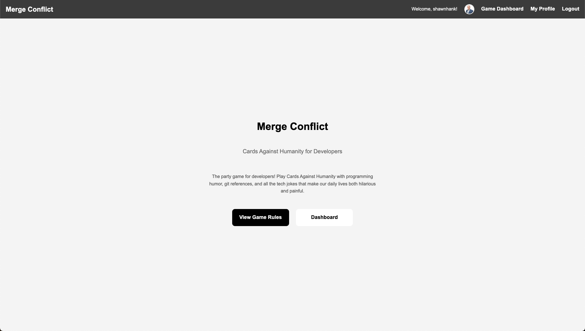
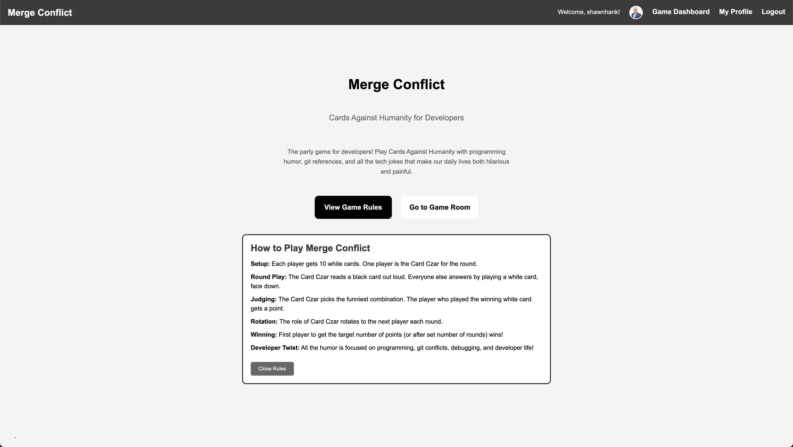
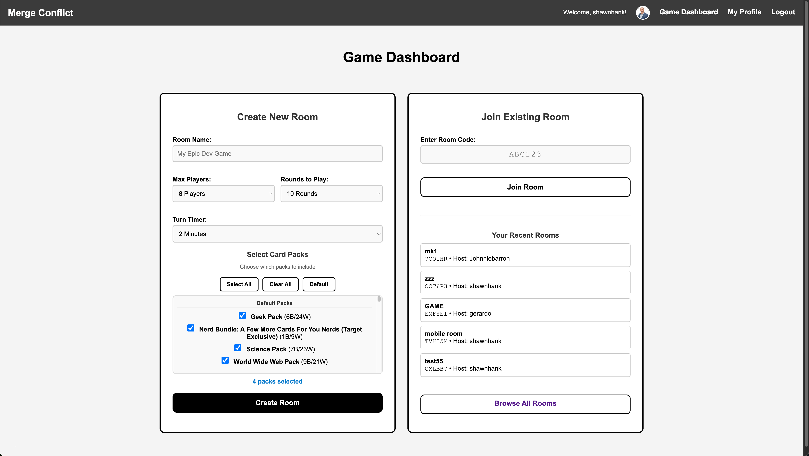
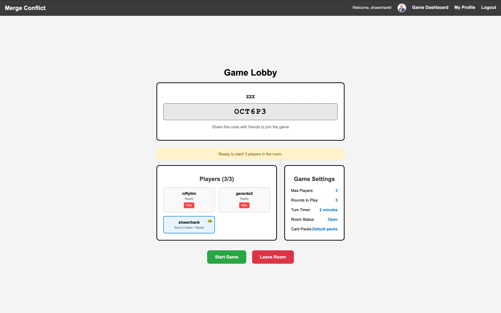
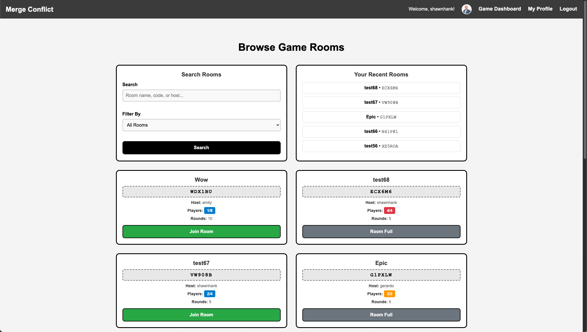
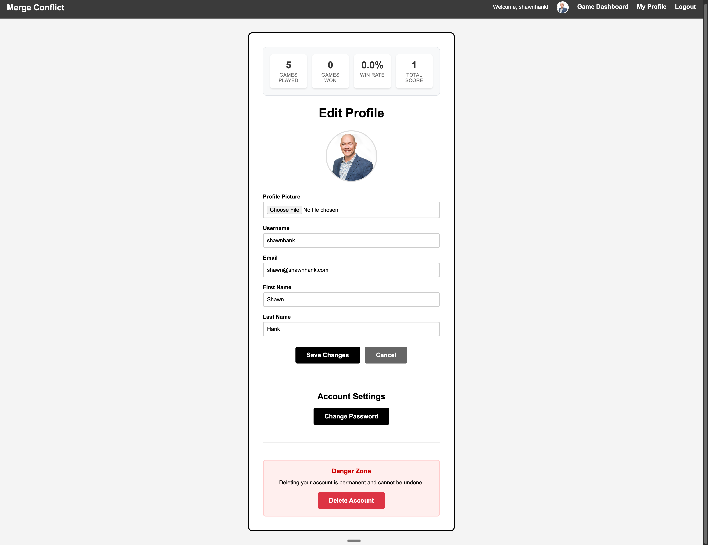

# Merge Conflict - A CAH Joint


A Django-based multiplayer card game that brings the humor of Cards Against Humanity to the world of software development. Battle your fellow developers with programming jokes, git references, and all the tech humor that makes our daily lives both hilarious and painful.

---
## 📸 Screenshots

**Home Page**



**Home Page Rules**



**Dashboard**



**Lobby**



**Room List**



**Player Profile with Stats**




---


## Links

[GitHub Repo](https://github.com/JohnnieBarron/MergeConflict)

[Heroku Game Link](https://mergeconflict-847c07d611a7.herokuapp.com/)

[Branded Merge Conflict Game Link](http://mergeconflict.thisdemo.rocks/)

---

## 🎯 Project Overview

**Team:** 4-person General Assembly Software Engineering Bootcamp project 

- [Shawn Hank](https://github.com/shawnhank) - Project Manager, Planning, Front End
- [Tim Lawler](https://github.com/tlawler1986) - Models, Database, Backend 
- [Gerardo Sanchez](https://github.com/gerardosdl) - Game Logic, API
- [Johnnie Barron](https://github.com/JohnnieBarron) - Git Manager, Models, Auth

---

## 🚀 Installation & Setup

### Prerequisites

- Django 5.2.3+
- Python 3.9+
- PostgreSQL
- Git

 ### Services

- **REST Against Humanity API**: Card content and game data
- **Against-Humanity GitHub Repo**: More card content and game data
- **Neon PostgreSQL**: Database hosting
- **Heroku**: Application deployment

## 🧑🏻‍🔧  Production Deployment

- **Platform**: Heroku
- **Database**: Neon PostgreSQL
- **Static Files**: Heroku static file serving
- **Environment**: Production settings with DEBUG=False

---

## 🎮 Game Features

### MVP Features (v1.0)

- **User Authentication**: Register, login, logout with Django auth
- **Room Management**: Create permanent rooms with 6-digit codes
- **Room Browser**: Search and filter active rooms, see recent rooms based on membership
- **Multiplayer Gameplay**: 3-10 players per game
- **Card System**: Integration with REST Against Humanity API and GitHub sources
- **Card Pack Selection**: Organized categories (Default, REST API, GitHub) with multi-select
- **Judge Rotation**: Fair turn-based judging system
- **Scoring System**: Track wins and game progression
- **Room Creator Controls**: Kick players, edit scores, end games early
- **Profile Management**: Upload avatars, edit username and profile details
- **Responsive Design**: Two-column layout with mobile-friendly interface

### Icebox Features (Future Releases)

- Game history and statistics
- Team play (multiple players as one team)
- Friend system and social features
- Custom card deck creation
- Spectator mode
- Advanced game rules and variations

---

## 🛠 Technical Architecture

### Database Design

```
9 Core Entities (MVP):
├── User (Django built-in + custom fields)
├── Room (permanent rooms with settings)
├── RoomMembership (M:M join table)
├── Game (1:1 with Room)
├── GamePlayer (player scores and hands)
├── Round (individual game rounds)
├── CardSubmission (player responses)
├── CardPack (card pack metadata)
└── Card (individual cards with pack relationship)

8 Additional Entities (Icebox):
├── GameSummary (game history)
├── Team & TeamMembership (collaborative play)
├── Friendship (social connections)
├── CustomDeck & CustomCard (user content)
├── Spectator (view-only access)
└── Notification (social alerts)
```

### Key Relationships

- **1:1**: Room → Game (one game per room)
- **1:M**: User → Room (creator), Game → Round, Round → CardSubmission
- **M:M**: User ↔ Room (through RoomMembership)

---

### Local Development Setup

```bash
# Clone the repository
git clone https://github.com/JohnnieBarron/MergeConflict.git
cd MergeConflict

# Install dependencies
pip install -r requirements.txt

# Set up environment variables
cp .env.example .env
# Edit .env with your database credentials

# Run migrations
python manage.py makemigrations
python manage.py migrate

# Create superuser
python manage.py createsuperuser

# Start development server
python manage.py runserver

# Optional: Import card data from additional sources
# Import cards from Against Humanity GitHub repository
python manage.py import_github_cards
```

### Environment Variables

```
SECRET_KEY=your-secret-key-here
DEBUG=True
DB_USER=your-database-username
DB_PW=your-database-password
DB_HOST=your-database-host
EMAIL_HOST_USER=your-email@example.com
EMAIL_HOST_PASSWORD=your-email-password
```

---

## 🎯 MVP User Stories

### Authentication & Information (4 stories)

1. **As a guest**, I want to see the rules and a description of the app on the home page, so I can understand how the game works before registering. **[NEW]**
2. **As a guest**, I want to register for an account with username and password, because I need to track my game history and join rooms.
3. **As a guest**, I want to log in with my credentials, because I need to access my account and join games.
4. **As a player**, I want to log out of my account, because I need to secure my session when done playing.

### Room Management with Creator Permissions (10 stories)

5. **As a player**, I want to create a new room with a permanent room code, because I want to host games for my friends.

6. **As a room creator**, I want to set a user-selectable number of rounds for the game, because different groups prefer different game lengths. **[NEW]**
7. **As a room creator**, I want to set a time limit (2-5 minutes) for player turns with a skip option, because games need to keep moving and handle inactive players. **[NEW]**
8. **As a room creator**,  I want to select one or more card packs from available options, because different packs provide variety and I want to customize the game content for my group.
9. **As a room creator**, I want to kick disruptive players from my room, because I need to maintain a positive game environment**
10. **As a room creator**, I want to delete my room when no longer needed, because permanent room codes should be cleaned up when done.
11. **As a player**, I want to join a room using a room code, because I need to play with specific friends.
12. **As a player**, I want to see all players currently in a room and who has joined, because I need to know who I'm playing with and ensure everyone is present. **[UPDATED]**
13. **As a room creator**, I want to ensure all invited players are present before starting the game, because the game works best with the intended group. **[NEW]**
14. **As a room creator**, I want to prevent new players from joining once a game is in progress, because adding players mid-game would disrupt gameplay. **[NEW]**
15. **As a room creator**, I want to start a new game when enough players have joined, because only I should control when gameplay begins.

### Core Gameplay (7 stories) 

15. **As a judge**, I want to see a random black card for the round, because I need to present the prompt to other players.
16. **As a player (non-judge)**, I want to select a white card from my hand to play, because I need to participate in the round.
17. **As a judge**, I want to see all submitted white cards anonymously and pick a winner, because I need to choose the funniest response.
18. **As a player**, I want to see my score update when I win a round, because I want to track my performance in the current game.
19. **As a player**, I want the judge role to rotate each round, because everyone should get equal chances to judge.
20. **As a room creator**, I want to edit scores if a mistake is made, because manual correction should be possible for errors. **[NEW]**
21. **As a room creator**, I want to end the game early with a summary of results, because sometimes games need to finish before completion. **[NEW]**

### Profile Management Features (6 stories)

22. **As a player**, I want to upload an avatar/profile picture, because I want to personalize my account.
23. **As a player**, I want to edit my username, because I might want to change my display name.
24. **As a player**, I want to update my email address, because my contact info might change.
25. **As a player**, I want to edit my first and last name, because I want to update my profile info.
26. **As a player**, I want to change my password, because I need to maintain account security.
27. **As a player**, I want to view my complete profile, because I want to see all my account information.

---

## 🎨 Design & UI

### Styling Framework

- **Base**: Custom CSS adapted from and inspired by [kay-who-codes Cards Against Humanity](https://github.com/kay-who-codes/Cards-Against-Humanity)
- **Cards**: Authentic black/white card styling
- **Layout**: Responsive grid system
- **Features**: Dark mode support, smooth animations

### Page Structure

1. **Homepage**: Guest welcome with rules and registration
2. **Dashboard**: Room creation and joining interface
3. **Game Lobby**: Player waiting area with settings
4. **Active Game**: Real-time gameplay interface

---

### [REST Against Humanity API](https://www.restagainsthumanity.com/gql/)

```python
# REST API Base URL
REST_API_URL = "https://restagainsthumanity.com/api/v2/"

# GraphQL API URL
GRAPHQL_API_URL = "https://www.restagainsthumanity.com/api/graphql"

# Available REST Endpoints
GET /packs - List available card packs
GET /cards?packs=pack1,pack2 - Get cards from specific packs
```

### [Against Humanity](https://github.com/nodanaonlyzuul/against-humanity)

```python
# Repository with JSON card data
# https://github.com/nodanaonlyzuul/against-humanity
# Contains cards.json with original CAH cards organized by expansion
```

---

## 🔒 Security Considerations

- **Authentication**: Django's built-in secure authentication
- **Input Validation**: Form validation and CSRF protection
- **Database**: Parameterized queries prevent SQL injection
- **API Keys**: Environment variables for sensitive data
- **Production**: HTTPS, secure headers, debug disabled

---

## 📈 Performance Optimizations

- **Card Storage**: Cards stored locally in PostgreSQL database for fast access
- **Query Optimization**: Database queries optimized with select_related/prefetch_related
- **Game Status Caching**: 30-second cache for game state to reduce database hits
- **Bulk Operations**: Card imports use bulk_create for efficiency
- **Database Indexing**: Optimized queries for game operations
- **Static Files**: Efficient CSS/JS delivery
- **Session Management**: Lightweight game state storage

---

## 🤝 Contributing

### Development Workflow

1. **Branch**: Create feature branch from main
2. **Develop**: Write code following Django best practices
3. **Test**: Ensure all functionality works correctly
4. **Review**: Team code review before merging
5. **Deploy**: Merge to main triggers production deployment

### Code Standards

- **Python**: PEP 8 compliance
- **Django**: Follow Django best practices
- **Templates**: Semantic HTML with accessible design
- **CSS**: Organized, commented stylesheets

---

## 📄 License

This project is created for educational purposes as part of the General Assembly Software Engineering Bootcamp.

---

## 🙏🏼 Acknowledgments

- **Cards Against Humanity**: Original game concept and inspiration (https://www.cardsagainsthumanity.com/)
- **REST Against Humanity**: API providing card content (https://www.restagainsthumanity.com/2.x/ & https://github.com/celsiusnarhwal/rest-against-humanity)
- **Against Humanity**: Plain text card files (https://github.com/nodanaonlyzuul/against-humanity)
- **kay-who-codes**: CSS styling foundation (https://github.com/kay-who-codes/Cards-Against-Humanity)
- **General Assembly**: Educational framework and support
- **Neon**: PostgreSQL database hosting
- **Heroku**: Application deployment platform
- **Trello**: Project Management
- **Wireframe.cc**: Wireframe documentation
- **Mermaidchart.com**: ERD diagrams & Gantt chart

## 📞 Contact

**Project Team**: General Assembly Software Engineering Cohort
**Repository**: https://github.com/JohnnieBarron/MergeConflict
**Live Demo**: https://merge-conflict-game.herokuapp.com

------

*Built with ❤️ and lots of merge conflicts by developers who understand the struggle.*